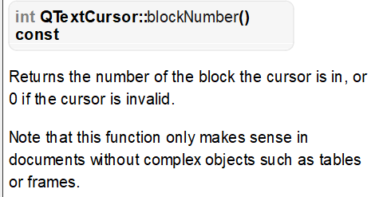
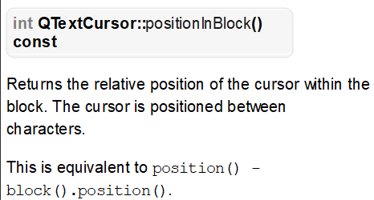
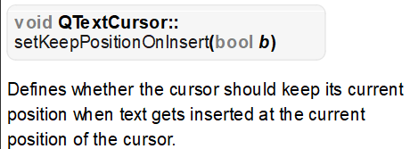
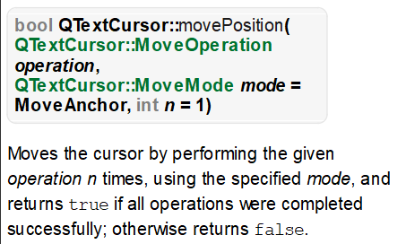
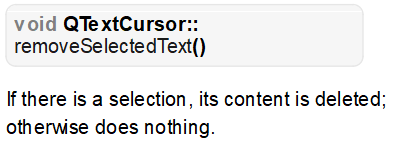
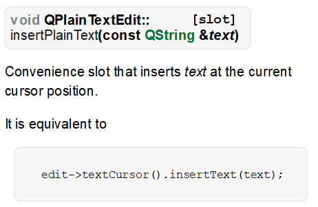
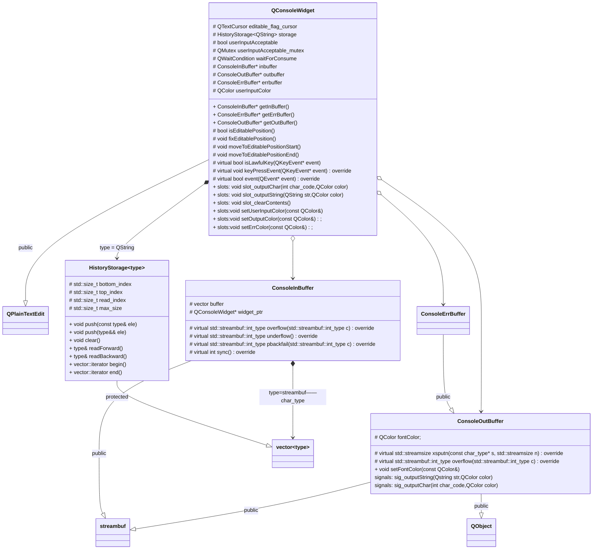
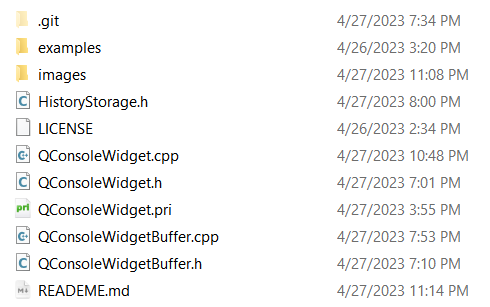
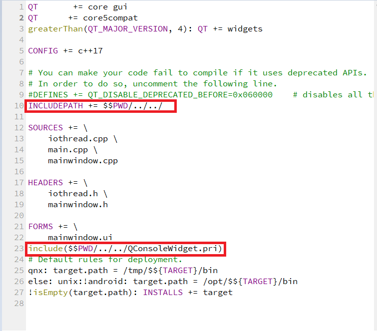

# QConsoleWidget

## 目录

[toc]

## 效果演示

- 以下演示项目的源代码已经放在了 example文件夹下

 


## 项目版本

| 版本号  | 版本说明 | 编辑时间      |
| ------- | -------- | ------------- |
| v-1.0.0 | 基本实现 | 2023年4月26日 |

## 项目目的

- 实现一个模拟控制台交互的Qt控件，**基于线程**拥有以下性质：
  - 可以通过标标准对象(`std::istream`  `std::ostream`)实现对控件中用户输入的读取和向控件输出消息
  - 实现部分可编辑：
    - 用户输入并回车后的消息不可被编辑
    - 缓冲区不为空的时候，不可被编辑
  - 缓冲区为空时，`std::istream`对象`operator>> `调用时会**阻塞此处的线程** ，同时**释放控件的编辑权**，使得用户的输入可以被接收。
  - 当用户回车后，输入的内容将被放入读取缓冲区，istream阻塞的线程将被唤醒，同时**收回控件的编辑权**。
  - 按上下键后，可以读取用户的历史输入（循环），并重新放到编辑区域


## 项目原理

### 如何定位可编辑区域


- 对于QPlainTextEdit来说，所有的文本都被存储在控件的QTextDocument对象中，而文本进一步是存储在 QTextDocument的QTextBlock里面的：

  - QTextBlock 的定位是 **自然段** ，用户每次按下回车（Qt::Key_Return）就表示当前的自然段（QTextBlock）的结束，以及一个新的自然段（QTextBlock）的开始。

- 用户编辑信息是通过**文本光标** （QTextCursor）实现的，可以通过以下两个成员函数获取文本光标在文档中的**绝对位置** 

  - `QTextCursor::blockNumber` ——获取光标所在自然段（QTextBlock）的编号

     

    

  - `QTextCursor::positionInBlock` ——获取光标在其所在自然段内的位置（**用字符定位**）

     

- **注意：在实验Demo过程中我曾直接使用这两个函数的返回值直接定位可编辑区域，但是这样在需要将编辑光标移动到可编辑区域的时候会比较复杂，于是经过改进，我们的项目采用的是以下的实现方案** 

- 虽然QPlainTextEdit **只能有一个可见光标** ，但是允许有多个不可见光标，我们可以通过设置一个不可见光标来标记**可编辑区域的起始点** ，当需要将光标移动到可编辑区域的起始点时可以调用以下成员函数函数：

   

  - 注意：默认情况下文本光标会随着插入文本而变化位置，我们的标记光标应当是不允许发生位置变化的，因此获取的时候需要调用以下函数设置其位置不可变（当然在设置可视光标前也需要调用这个函数将光标设置尾随插入文本移动，否则可视光标将**无法接收用户的输入**）：

     

   

### 如何设置文档是否可编辑

- 上面我们已经介绍过了**如何去定位可编辑区域** ，而设置文档可编辑区域其实很简单：
  - QPlainTextEdit所有和键盘有关的响应实际上都是由它的键盘事件处理函数 keyPressEvent实现的, 并且这个函数是一个**虚函数** ，这意味着我们可以重写这个函数，在它的基类版本调用之前先进行条件判断：当前光标是否在可编辑区域，在非可编辑区域时是不是合法的键盘输入（**比如ctrl+c等拷贝快捷键应当是可以使用的**），如果是不合法的键盘输入就可以将光标移动到我们的可编辑区域，然后再交给基类的键盘事件处理。

### 如何读取用户的输入以及历史消息回滚

- 根据需求，在用户按下回车键的时候需要将用户的输入存到一个容器中，并且当用户按下上下键的时候可以进行历史输入的回滚，这些操作还是需要我们通过重写 `QPlainTextEdit::keyPressEvent` 来实现，前面我们已经介绍了使用不可见文本光标来定位可编辑区域的操作，并且还提到了所有的文本都是存储在自然段 QTextBlock 中的，我们可以根据可编辑光标找到对应的block，或者直接获取文档的最后一个block （此时还未调用基类的keyPressEvent,还没有创建新的block,因此接收用户输入的block就是文档中最后一个block）。找到block后需要定位可编辑区域的起始位置，此时可以调用我们前面提到的函数 `QTextCursor::positionInBlock` ,只要将对应的block中这个位置之后的字符读取出来放到历史输入容器中即可。

- 实现历史消息回滚也比较容易: 将可视光标移动到可编辑区域开始的地方，然后以固定锚点的方式将光标移动到文档的末尾，这样就选中了用户当前的输入，再将这个选中的文本移除就实现用户当前输入的清空，另外从历史容器中读出用户的上一次输入，再将它插入到文档中就实现了历史消息的回滚。

  - 上面提到的功能可以用以下的函数实现：

    - 固定锚点移动光标，实现对文本的选择：

       

    - 清空选中的文本:

       

      

    - 在光标的位置插入文本

       


### 如何实现用标准流实现控件的IO

- 我在之前的博客中介绍过标准流对象的IO实际上是委托给缓冲区对象实现的：`std::basic_streambuf<>` 
  - 博客地址（深入理解iostream小标题）：
    - [C++&Qt经验总结【三】_学艺不精的Антон的博客-CSDN博客](https://blog.csdn.net/yyy11280335/article/details/129637305?spm=1001.2014.3001.5501)  
    - [C++&Qt经验总结【四】_学艺不精的Антон的博客-CSDN博客](https://blog.csdn.net/yyy11280335/article/details/130013427?spm=1001.2014.3001.5501) 
- 因此我们需要做的事情就是：**定制我们的QConsoleWidget控件专属的缓冲区对象** 

#### 输出流缓冲区

- 输出流缓冲区也就是我们所说的 std::ostream 需要用的缓冲区，由于直接输出到控件，这个过程其实是不需要缓冲的，直接在对应的函数中调用 QPlainTextEdit::insertText 插入文本即可。

- 以下列出需要重写的**基类虚函数** ，详细的原理可以直接参考源代码

  | 函数                                                         | 作用                                                         |
  | ------------------------------------------------------------ | ------------------------------------------------------------ |
  | `std::streambuf::int_type overflow(std::streambuf::int_type c)` | 该函数会在缓冲区溢出的时候调用，输出流缓冲区没有使用缓冲，因此一旦插入字符（单个字符）就需要调用该函数（一般是用来供给控制符std::endl插入换行符使用） |
  | `std::streamsize xsputn(const char_type* s, std::streamsize n)` | 该函数供给缓冲区放入连续的字符时调用（大多数情况都是使用该函数） |

- 另外有关多线程的安全性问题，我将在示例中进行测试

#### 输入流缓冲区

- 相对于输出流缓冲区，输出流缓冲要相对复杂的多，因为需要我们自己设置一段连续内存。

- 本项目中我使用的是标准库的vector来作为缓冲区内存的，因为内存管理相对方便一些，另外通过`std::ostream` 来实现将用户输入的内容存入缓冲区

- 以下列出需要重写的**基类虚函数** ，详细原理可以直接参考源代码

  | 函数                                                         | 作用                                                         |
  | ------------------------------------------------------------ | ------------------------------------------------------------ |
  | `std::streambuf::int_type overflow(std::streambuf::int_type c)` | 当缓冲区不足以放置数据时，调用该函数对原来的空间进行扩展     |
  | `std::streambuf::int_type underflow()`                       | 当缓冲区没有可读的数据时，需要调用该函数处理，这个函数算是输入流缓冲区的核心 |
  | `std::streambuf::int_type pbackfail(std::streambuf::int_type c)` | 用于实现将字符放回缓冲区                                     |
  | `int sync()`                                                 | 缓冲区的刷新需要使用该函数，在cin cout等全局流对象的缓冲区对象中，该函数是用于与C语言标准数据流同步的 |

- **注意** ： 由于C++底层会根据系统地区自动设置国际化，我们不需要去关注编码的问题，流缓冲对象派生自 `streambuf` (`basic_streambuf<char>`) 即可

#### 交互过程涉及到的并发同步问题：

- 对于输出流缓冲区的操作，经过测试每一次调用ostream时是并发安全的，因此不需要再多做额外的安全措施

- 对于输入流缓冲区的操作则是一个经典的**生产者与消费者模型** ：

  - 用户输入(`keyPressEvent`) 相当于一个生产者，负责向输入流缓冲区放入数据
  - 输入流调用处所在线程相当于一个消费者，负责从输入流缓冲区中取出数据

- 可以得到以下模型：

  ```mermaid
  graph TB
  Producer(用户输入keyPressEvent)
  ConsumerA(读取线程A)
  ConsumerB(读取线程B)
  Buffer(缓冲区)
  Producer--放置数据-->Buffer
  Buffer--取数据-->ConsumerA
  Buffer--取数据-->ConsumerB
  ```

- 与原本的**生产者与消费者模型**有细微的区别：**只有缓冲区为空的时候才允许生产者进行生产** ，那么可以设计出以下的PV操作流程:

  - 首先需要一个变量表示键盘事件是否可以被接受（这里命名为UserInputAcceptable）,并且这个变量使用一个互斥锁(UserInputAcceptableMutex)来维护
  - 由于缓冲区数据为空的情况会被underflow函数处理，因此本项目中不太适合用信号量来记录缓冲区剩余数据，以及实现调用处阻塞。不过我们有一个更好的选择: `QWaitCondition` ,这个同步机制可以将一个互斥量释放掉，以便其它的线程使用它，同时将自己阻塞，直到其它的线程唤醒。以下流程中将使用waitForComsume表示一个 `QWaitCondition` 对象

  ```mermaid
  graph LR
  回车时将UserInputAcceptable值归为假并唤醒阻塞线程-->被唤醒
  UserInputAcceptable-->值为假-->丢弃事件-->键盘事件循环
  缓冲区是否为空-->空-->调用underflow在其内部修改UserInputAcceptable为真-->用waitForConsume释放互斥锁UserInputAcceptableMutex阻塞自己-->被唤醒-->
  缓冲区是否为空
  键盘事件循环-->UserInputAcceptable-->值为真-->调用基类版本处理键盘事件-->回车时将UserInputAcceptable值归为假并唤醒阻塞线程-->键盘事件循环
  
  
  ```

  因为要用互斥锁维护InputableMutex维护UserInputAcceptable,因此每次修改UserInputAcceptable,都需要锁定互斥量InputableMutex


## 项目可能的扩展方向

1. 以源码方式直接嵌入到其它项目中 （当前版本解决）
2. 字体修改，字色修改（当前版本解决）
3. 以插件方式加载到其它项目中 （后期迭代实现）
4. 根据需求修改合法键盘按键（当前版本实现, 其逻辑规模较小，暂时不需要使用**状态模式** 进行扩展性优化，因此采取**虚函数重写的方式进行功能扩展**） 

## 项目结构

**以下的UML图只包含了比较重要的关系，一些Qt本来就有的依赖关系就不做阐述了** 




## 函数文档

[函数文档](docs/函数文档.md)  


## 将本项目导入到自己的项目中

- 如下是仓库表层的文件示意

   


- 本项目所需的所有的文件都在这一层
- 你可以选择将QConsoleWidgetBuffer.pri 添加到你的项目文件`.pro`中 同时添加路径
  -  
  - 

## 注意事项

- 本项目的目的是高度模拟标准库(cin cout)的输入输出交互体验，对于标准库未解决的一些同步问题 (如多线程调用cin读取数据时可能造成不可预测的结果)不会进行解决。请在必要的时候使用互斥锁或者信号量实现同步。
- 项目中使用到了Qt字符串引用对象`QStringRef` ，需要在项目文件 (`.pro`) 文件头部添加：`QT +=  core5compat` 
- 进行io操作时必须在多线程中执行，否则有可能造成死锁

### 缺陷性报告

#### 发现报告

|   发现日期    | 版本号  |                             描述                             | 是否解决 |
| :-----------: | :-----: | :----------------------------------------------------------: | :------: |
| 2023年4月28日 | v-1.0.0 | 上下键历史消息回滚时颜色异常（在已有输入的情况下进行消息回滚，颜色会跟随流输出的颜色） |    否    |

#### 解决报告

| 解决日期 | 发现的版本号 | 解决的版本号 | 描述 | 解决方案 |
| -------- | ------------ | ------------ | ---- | -------- |
|          |              |              |      |          |

